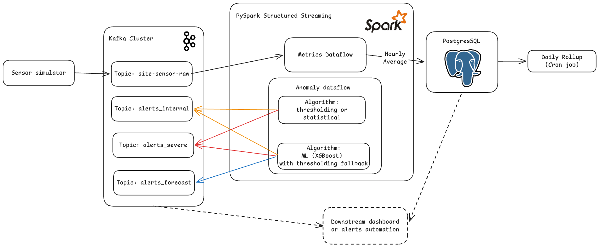

# NoDust

A PySpark stream processing system to monitor pollution levels across distributed construction sites and automatically flag sites for pollution-level violations, sending swift alerts to authorities.

> **Status:** This project currently relies on **simulated sensor data**. A built-in sensor simulator generates realistic pollution telemetry (including spikes, sustain, and decay phases) so the full pipeline can be developed and tested end-to-end without physical hardware.

---

## Table of Contents

- [Overview](#overview)
- [Features](#features)
- [Architecture](#architecture)
- [Tech Stack](#tech-stack)
- [Project Structure](#project-structure)
- [Detection Algorithms](#detection-algorithms)
- [Data Flow](#data-flow)
- [Prerequisites](#prerequisites)
- [Quick Start](#quick-start)
- [Configuration](#configuration)
- [Usage](#usage)
- [Database Schema](#database-schema)
- [Visualization](#visualization)
- [Development](#development)
- [Roadmap](#roadmap)
- [License](#license)

---

## Overview

NoDust is a real-time pollution monitoring system built on PySpark Structured Streaming. It ingests sensor readings from construction sites via Kafka, processes them through two concurrent streaming dataflows, and produces:

1. **Metrics** — Hourly aggregated averages persisted to PostgreSQL for reporting and trend analysis in the future.
2. **Anomaly Alerts** — Real-time violation detection routed to dedicated Kafka alert topics based on severity and type.

The system consists of multiple pluggable detection algorithms ranging from simple categorical thresholds to fuzzy thresholding and XGBoost-based forecasting, allowing operators to trade off simplicity, sensitivity, and predictive capability.

---

## Features

- **Real-time stream processing** with PySpark Structured Streaming and Kafka
- **Pluggable detection algorithms** selectable at runtime via environment variables:
  - Simple categorical thresholding
  - Fuzzy thresholding with temporal escalation zones
  - Exponential Moving Average (EMA) thresholding
  - XGBoost-based multi-horizon forecasting (15 min, 1 hr, 3 hr)
- **Dual dataflows** running concurrently on a shared SparkSession:
  - Metrics aggregation → PostgreSQL
  - Anomaly detection → Kafka alert topics
- **Simulated sensor fleet** for development without physical devices
- **Dockerized deployment** with Spark cluster (1 master + 2 workers hardcoded for now), Kafka, and PostgreSQL
- **Automated daily rollups** via a cron-based PostgreSQL procedure
- **Configurable pollution thresholds** via a simple YAML file

---

## Architecture




### Components

| Component | Description |
|-----------|-------------|
| **Sensor Simulator** | Generates JSON pollution measurements (PM2.5, PM10) to Kafka with configurable site count, emission rate, and variability. |
| **Kafka** | Message broker carrying raw sensor data and routed alert streams. |
| **Spark Cluster** | Master + 2 workers running PySpark Structured Streaming queries. |
| **Metrics Dataflow** | Aggregates 1-hour tumbling window averages and upserts to PostgreSQL. |
| **Anomaly Dataflow** | Applies the selected detection algorithm and publishes alerts to Kafka topics. |
| **PostgreSQL** | Stores hourly and daily aggregated metrics with upsert support. |
| **Daily Rollup** | Cron-based container that calls a stored procedure to compute daily averages. |

---

## Tech Stack

| Category | Technology |
|----------|-----------|
| Stream Processing | PySpark 4.1.1 (Structured Streaming) |
| Message Broker | Apache Kafka (KRaft mode) |
| Storage | PostgreSQL 16 |
| ML / Forecasting | XGBoost, scikit-learn |
| Data Processing | Pandas, PyArrow |
| ORM / DB Access | SQLAlchemy, psycopg2 |
| Visualization | Matplotlib |
| Containerization | Docker, Docker Compose |
| Package Manager | [uv](https://github.com/astral-sh/uv) |
| Python | ≥ 3.12 |

---

## Project Structure

```text
NoDust/
├── main.py                       # Entry point: runs metrics and/or anomaly dataflows
├── compose.yaml                  # Docker Compose orchestration (Kafka, Spark, Postgres, sensor)
├── dockerfile                    # Spark image with Python deps
├── sensor/
│   ├── dockerfile                # Lightweight Python image for the simulator
│   ├── sensor_simulator.py       # Simulated pollution sensor sending via Kafka producer
│   └── visualization.py          # Matplotlib vizualization script for debugging of simulator
└── system/
    ├── algorithms.py             # Detection algorithms (Thresholding, Fuzzy, EMA, XGBoost)
    ├── anomaly_dataflow.py       # Anomaly detection streaming query builder
    ├── metrics_dataflow.py       # Metrics aggregation streaming query builder
    ├── schemas.py                # PySpark StructType schemas for sensor & alert data
    ├── thresholds.yaml           # Pollutant threshold configuration (green/yellow/orange/red)
    └── database/
        └── init.sql              # PostgreSQL schema, triggers, and daily rollup procedure
```

---

## Detection Algorithms

All algorithms implement a common interface: they accept a parsed Spark DataFrame of sensor readings and return alert DataFrames. They are registered in `ALGORITHM_REGISTERY` and selected at runtime via the `ALGORITHM` environment variable.

### 1. `Thresholding` — Simple Categorical Thresholding

The baseline algorithm. Each reading is evaluated against fixed category boundaries defined in `thresholds.yaml`. Readings in the **orange** band produce internal alerts; readings at or above the **red** threshold produce severe alerts.

- **Stateless** — each event is evaluated independently
- **Fastest** — no state tracking or windowing required
- **Best for:** straightforward compliance checking with clear limits

### 2. `FuzzyThresholding` — Fuzzy Zone with Temporal Escalation

Introduces dual fuzzy zones below the orange and red hard limits. A reading inside a fuzzy zone does not immediately trigger an alert; instead, the system tracks how long the concentration remains in the zone. If the dwell time exceeds a concentration-dependent time limit, an alert is escalated.

- **Stateful** — uses `applyInPandasWithState` to track per-site/per-pollutant entry timestamps
- **Configurable** — `max_time` (max dwell seconds) and `fuzzy_start_delta` (zone width below the hard limit)
- **Best for:** catching sustained high readings that would still stay just under regulatory limit

### 3. `EMAThresholding` — Exponential Moving Average

Smooths the concentration signal using an EMA per site and pollutant before comparing against thresholds. This dampens short-term noise and highlights sustained trends.

- **Stateful** — maintains the running EMA value per group in Spark state
- **Configurable** — `alpha` (smoothing factor, 0–1), `watermark_duration`
- **Best for:** noisy sensors where instantaneous spikes should not trigger alerts but underlying trends should. Mainly for reducing false positives.

### 4. `XGBoostForecasting` — ML-Based Multi-Horizon Forecasting

For forecasting and acting pre-maturely if possible. It performs two functions concurrently:

1. **Hard threshold alerting** — same as `Thresholding` for immediate violations
2. **Forecasting** — trains XGBoost classifiers on historical Kafka data to predict the pollution category (green/yellow, orange, red) at three future horizons: **15 min**, **1 hr**, and **3 hr**

- **Offline training phase** — collects historical data from Kafka (currently waits for ≥ 5 days of data before training)
- **Features**:
    - normalized concentration
    - hour of day
    - day of week
- **Stateful inference** — per-site/per-pollutant stateful streaming inference
- **Outputs** — internal alerts, severe alerts, and a dedicated forecasts topic
- **Best for:** proactive intervention before violations occur

---

## Data Flow

### Sensor $\rightarrow$ Kafka

The simulator (`sensor/sensor_simulator.py`) emits JSON messages to the `site-sensor-raw` topic:

```json
{
  "sensor_id": "uuid",
  "site_id": "SITE_01",
  "timestamp": "2026-01-01T12:00:00+00:00",
  "pollutant_type": "PM2.5",
  "concentration": 420.5,
  "unit": "µg/m³"
}
```

### Kafka $\rightarrow$ Spark $\rightarrow$ Outputs

Spark reads from Kafka and splits out into two concurrent streaming queries:

| Dataflow | Input | Output | Sink |
|----------|-------|--------|------|
| **Metrics** | `site-sensor-raw` | 1-hour windowed averages | PostgreSQL (`sensor_averages_hourly`) |
| **Anomaly** | `site-sensor-raw` | Internal alerts (orange) | Kafka `alerts_internal` |
| | | Severe alerts (red) | Kafka `alerts_severe` |
| | | Forecasts (XGBoost only) | Kafka `alerts_forecasts` |

### PostgreSQL $\rightarrow$ Daily Rollup

A cron-based container periodically calls the `compute_daily_averages()` stored procedure, which aggregates hourly averages into the `sensor_averages_daily` table.

---

## Quick Start

The fastest way to run the entire system is with Docker Compose:

```bash
# Clone the repository
git clone https://github.com/sanyamjain0315/NoDust.git
cd NoDust

# Start all services (Kafka, Spark cluster, sensor simulator, Postgres, dataflow)
docker compose up --build
```

This will:

1. Start a Kafka broker in KRaft mode
2. Launch the sensor simulator producing data to `site-sensor-raw`
3. Start a Spark cluster (1 master + 2 workers)
4. Start PostgreSQL with the schema initialized
5. Submit the Spark dataflow job (`--mode all`) using the `XGBoostForecasting` algorithm
6. Start the daily rollup cron job

### Accessing the UIs

| Service | URL |
|---------|-----|
| Spark Master UI | http://localhost:8080 |
| Spark Worker 1 UI | http://localhost:8081 |
| Spark Worker 2 UI | http://localhost:8082 |
| Spark Driver UI | http://localhost:4040 |
| PostgreSQL | `localhost:5432` (db: `DB`, user: `postgres`, password: `password`) |

---

## Configuration

### Environment Variables

#### Spark Dataflow

| Variable | Default | Description |
|----------|---------|-------------|
| `KAFKA_BOOTSTRAP_SERVERS` | `kafka:9092` | Kafka broker address |
| `SENSOR_TOPIC` | `site-sensor-raw` | Input topic for raw sensor data |
| `INTERNAL_ALERTS_TOPIC` | `alerts_internal` | Output topic for orange-level alerts |
| `SEVERE_ALERTS_TOPIC` | `alerts_severe` | Output topic for red-level alerts |
| `FORECASTS_ALERTS_TOPIC` | `alerts_forecasts` | Output topic for XGBoost forecasts |
| `ALGORITHM` | `Thresholding` | Detection algorithm to use (see [Detection Algorithms](#detection-algorithms)) |
| `POSTGRES_URI` | `postgresql+psycopg2://...` | PostgreSQL connection string for metrics sink |

#### Sensor Simulator

| Variable | Default | Description |
|----------|---------|-------------|
| `KAFKA_BOOTSTRAP_SERVERS` | `localhost:9092` | Kafka broker address |
| `KAFKA_TOPIC` | `site-sensor-raw` | Topic to produce messages to |
| `NUM_SITES` | `5` | Number of simulated construction sites |
| `SLEEP_MS` | `800` | Mean milliseconds between messages |
| `SLEEP_STDDEV_MS` | `200` | Jitter for sleep interval |
| `EVENT_TIMESTAMP_RATE_MS` | `900000` | Event-time increment per message (15 min) |
| `METRIC_MEAN` | `0` | Mean change in concentration per tick |
| `METRIC_STD_DEV` | `1` | Standard deviation of concentration change |

### Threshold Configuration (Default)

Pollution thresholds are defined in [`system/thresholds.yaml`](system/thresholds.yaml) using a four-tier category system:

```yaml
PM2.5:
  green:  { min: 0,   max: 100 }
  yellow: { min: 100, max: 350 }
  orange: { min: 350, max: 430 }
  red:    { min: 430, max: 1000 }
```

- **Green/Yellow** — normal levels, no alerts
- **Orange** — internal alert (potential violation)
- **Red** — severe alert (critical violation)

Thresholds are min-inclusive and max-exclusive. Add new pollutants by adding new top-level keys.

---

## Usage

### Running via Docker Compose

```bash
# Run everything (default: XGBoostForecasting algorithm)
docker compose up --build

# Use a different algorithm by editing compose.yaml:
#   ALGORITHM: Thresholding
#   ALGORITHM: FuzzyThresholding
#   ALGORITHM: EMAThresholding
#   ALGORITHM: XGBoostForecasting
```

### Running Locally (without Docker)

```bash
# Install dependencies with uv
uv sync

# Ensure Kafka and PostgreSQL are running and accessible,
# then set the required environment variables and run:
python main.py --mode all

# Or run a single dataflow:
python main.py --mode metrics
python main.py --mode anomaly
```

---

## Database Schema

PostgreSQL is initialized via [`system/database/init.sql`](system/database/init.sql).

### `sensor_averages_hourly`

| Column | Type | Description |
|--------|------|-------------|
| `site_id` | VARCHAR(50) | Construction site identifier (PK) |
| `pollutant_type` | VARCHAR(50) | Pollutant (e.g., PM2.5, PM10) (PK) |
| `start_time` | TIMESTAMP | Window start time (PK) |
| `avg_value` | DOUBLE PRECISION | Average concentration for the hour |

A trigger (`enforce_hourly_cap`) retains at most 25 hourly rows per site/pollutant, evicting the oldest entry when the cap is reached.

### `sensor_averages_daily`

| Column | Type | Description |
|--------|------|-------------|
| `site_id` | VARCHAR(50) | Construction site identifier (PK) |
| `pollutant_type` | VARCHAR(50) | Pollutant (PK) |
| `log_date` | DATE | Aggregation date (PK) |
| `daily_avg` | DOUBLE PRECISION | Average of hourly averages for the day |
| `last_updated_at` | TIMESTAMP | Last rollup computation time |

The `compute_daily_averages()` stored procedure is invoked by the `daily-rollup` cron container.

---

## Limitations

- XGBoost algorithm slows down production of simple thresholding alerts, since both of them run under the same dataflow job. 
- Separating them into two concurrent jobs would be diserable
- Anything beyond writing alerts to kafka is *out-of-scope* for this project (besides postgres writes).
- Idea is, someone could use the alerts to connect to counter-measures for pollution control, or alert notifications to authorities, or any other action to be decided by downstream kafka readers.

---

## Roadmap

- [ ] Cloud deployment and IaC config files
- [ ] Add CI/CD pipeline
- [ ] Separate Forecasting algo into separate dataflows with simple thresholding fallback
- [ ] Testing with real world data
